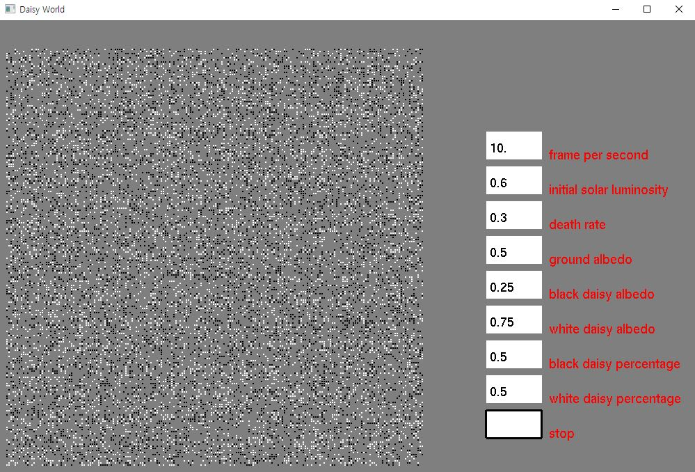

# DaisyWorld

This program visualizes daisyworld simulation.
What is daisyworld? As noted in [Wikipedia](https://en.wikipedia.org/wiki/Daisyworld), daisyworld is a simulation model to illustrate the plausibility of the [Gaia hypothesis](https://en.wikipedia.org/wiki/Gaia_hypothesis), by using simple Sun-Earth model with 2 types of daisies with distinct albedos, populating the Earth.

## Implementation

Upon executing .exe file found in the project directory (already compiled under Microsoft visual studio project environment), windows somewhat similar to below image will appear. 
 
### What's on the screen?
On the left side, is the panel which displays the 200x200 pixel-sized Earth, where each pixel can either be vacant (grey), or populated with either types of daisies(black or white). This panel will display the existance of the daisies as the time passes in the simulation environment. 
On the right side, is the control panel where you can change the hyperparameters of the simulation. You can select each box By clicking it, and it will be highlighted with black edges. Then, you can type  your desired value to that box, and program will override that value with your input. After making all the changes, press the start button (which is at the bottom) to simulate from the beginning with new values.

